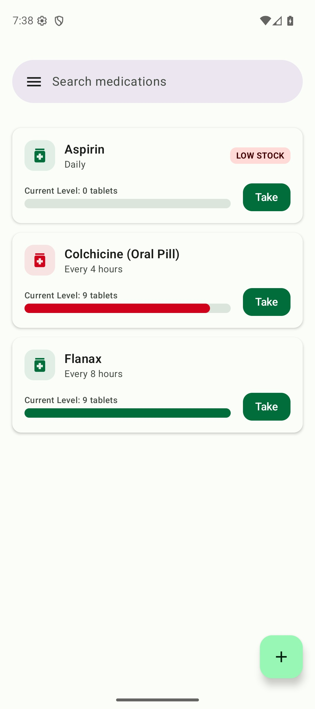
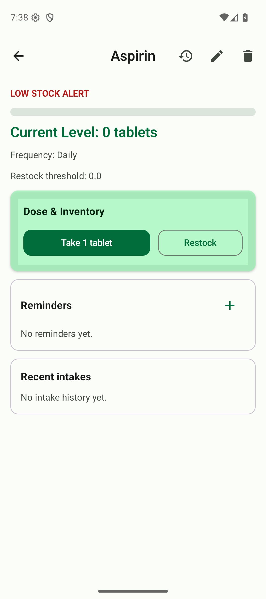
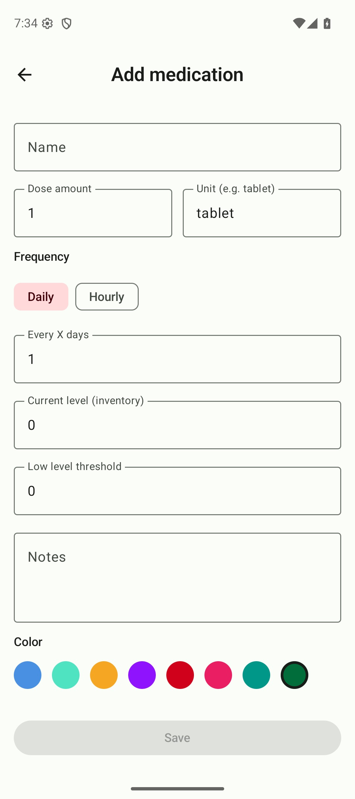

# MedsMe: Pill & Med Reminder

**Never miss a dose. Track medications, set reminders, and monitor your stock.**

MedsMe is your simple, reliable, and privacy-focused companion for managing medications. Whether you’re managing a single prescription or multiple daily supplements, MedsMe ensures you never miss a dose and always know when it’s time to restock.

  
  
  

### 🕒 RELIABLE REMINDERS
Never forget your medication again. Set precise intake reminders with exact alarms that work even after your device reboots.

### 📦 INVENTORY MANAGEMENT
Stop worrying about running out. MedsMe tracks your current inventory and alerts you when stock is low, so you can restock before you run out.

### 📝 INTAKE HISTORY
Keep a clear record of your health. Log each dose as you take it and view your recent intake history to stay on track with your treatment plan.

### 🔍 SMART SEARCH & SUGGESTIONS
Adding medications is fast and easy. Search through common medications and find suggestions to quickly set up your list.

### 🔒 PRIVACY FIRST
Your health data is personal. MedsMe stores all your information locally on your device. We do not collect, share, or sell your personal health information to third parties.

### KEY FEATURES:
- **Exact Alarms:** High-precision reminders for your schedule.
- **Low Stock Alerts:** Automatic background checks to notify you of low inventory.
- **Flexible Scheduling:** Set frequencies by hours or days.
- **Detailed History:** Track when you took each dose.
- **Material Design:** A clean, modern, and easy-to-use interface built with Jetpack Compose.

---

### Legal Documents

- [Privacy Policy](privacy-policy)
- [Terms & Conditions](terms-and-conditions)

---
[Back to Home](/)
